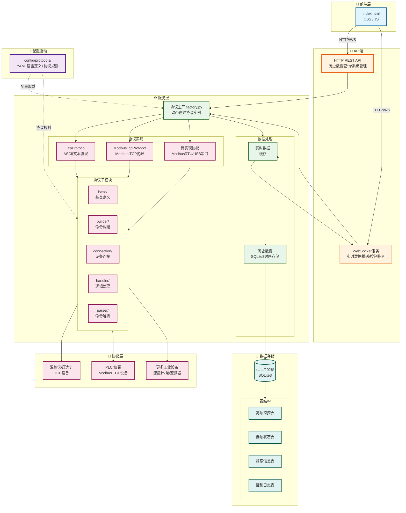
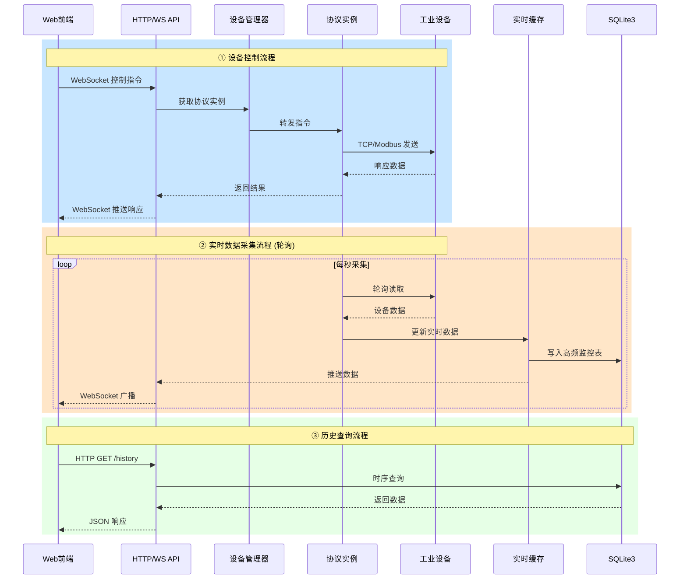

# DeviceHub 工业设备监控网关

基于 Python FastAPI 的工业设备数据采集、监控和控制网关服务。支持通过 TCP 协议与多种工业设备（温控仪、压力计、流量计、泵等）通信，提供 WebSocket 实时数据推送和 HTTP 历史数据查询接口。
[->bilibili演示视频](https://b23.tv/BV1Sn9eBLEzF)

## 示意图

### 架构图



### 数据流



## 特性

1. 架构设计
   1. 分层架构：清晰的协议层、服务层、API层分离
   2. 模块化扩展：易于添加新设备类型和通信协议
   3. 配置驱动：YAML 配置文件驱动设备定义和协议规则
2. 协议支持
   1. TcpProtocol：标准的 ASCII 文本协议（已实现）
   2. ModbusTcpProtocol：Modbus TCP 协议（待实现）
   3. ModbusProtocol：串口 Modbus 协议（待实现）
   4. AsciiSerialProtocol：ASCII 串口协议（待实现, 目前可使用串口服务器通过 TCP over Serial实现通信）
   5. 更多协议等待支持...
3. 数据管理
   1. 实时数据：WebSocket 实时推送
   2. 历史数据：SQLite3 时序数据库存储
      可通过 `http://localhost:8000/static/page/history.html` 访问历史数据查询界面
   3. 数据优化：复合索引加速查询，周表分片管理
   4. 数据类型：高频监控、低频状态、静态信息、控制日志
4. 接口服务
   1. WebSocket：实时设备数据订阅和控制
   2. HTTP REST API：历史数据查询和系统管理
   3. 前端集成：完整的 Web 监控界面

## 快速开始

1. 环境要求
   Python 3.10+(开发版本为Python 3.14.2)
2. 安装步骤
   1. 克隆项目仓库(或直接下载项目压缩包)
   ```
   git clone https://github.com/rnscreen/DeviceHub.git
   ```
   1. 安装依赖以及虚拟环境
   ```
   cd DeviceHub
   scripts/install.cmd
   ```
   1. 运行服务
   ```
   scripts/run.cmd
   ```
   1. 访问前端监控界面
      打开浏览器，访问 `http://localhost:8000` 查看实时监控
3. 协议配置文件结构

```DeviceHub
├─ backend
│  ├─ app
│  │  ├─ api    # 后端API接口
│  │  ├─ main.py    # 后端主程序
│  │  ├─ models # 数据模型
│  │  ├─ services # 服务层
│  │  │  ├─ protocols    # 协议服务层
│  │  │  │  ├─ base    # 基类
│  │  │  │  ├─ builder    # 命令构建器
│  │  │  │  ├─ connection    # 设备连接层
│  │  │  │  ├─ factory.py   # 协议工厂
│  │  │  │  ├─ handler    # 设备逻辑处理层
│  │  │  │  ├─ parser    # 命令解析器
│  │  │  │  └─ tcp.py    # TCP协议类
│  │  └─ utils
│  │     ├─ config_utils.py  # 配置工具类
│  │     └─ verify.py  # 校验码生成类
│  └─ requirements.txt  # python依赖库
├─ CHANGELOG.md
├─ config   # 配置目录
│  └─ protocols    # 协议配置目录
├─ data # 数据目录, 根据年份创建文件夹
│  └─ 2026
├─ debug_protocol.py
├─ frontend # 前端目录
│  └─ static
│     ├─ css
│     ├─ js
│     └─ index.html
├─ README.md
├─ scripts 
│  ├─ install.cmd  # Windows安装虚拟环境以及依赖
│  ├─ install.sh  # linux安装脚本, 未经过测试
│  ├─ run.cmd  # windows运行脚本
│  └─ run.sh  # linux运行脚本, 未经过测试
└─ shared # 共享目录，未使用
   ├─ openapi
   ├─ schema
   └─ types
```

## 许可证

### 当前许可证

本项目采用 **[Apache License 2.0](LICENSE)** 开源许可证发布。

### 商业合作

如有商业合作需求（定制开发、技术支持、企业部署等），请联系：[Rnscreen](mailto:rainscreen12@outlook.com)

### 免责声明

⚠️ **重要提示**：

1. 本项目仍在积极开发中，API 和功能可能发生变化
2. 为支持项目可持续发展，未来可能引入商业授权功能
3. 具体法律条款以 [LICENSE](LICENSE) 文件为准

***

版本: V0.1.2
最后更新: 2026年4月29日
DeviceHub - 让设备接入更简单(bushi)\~
